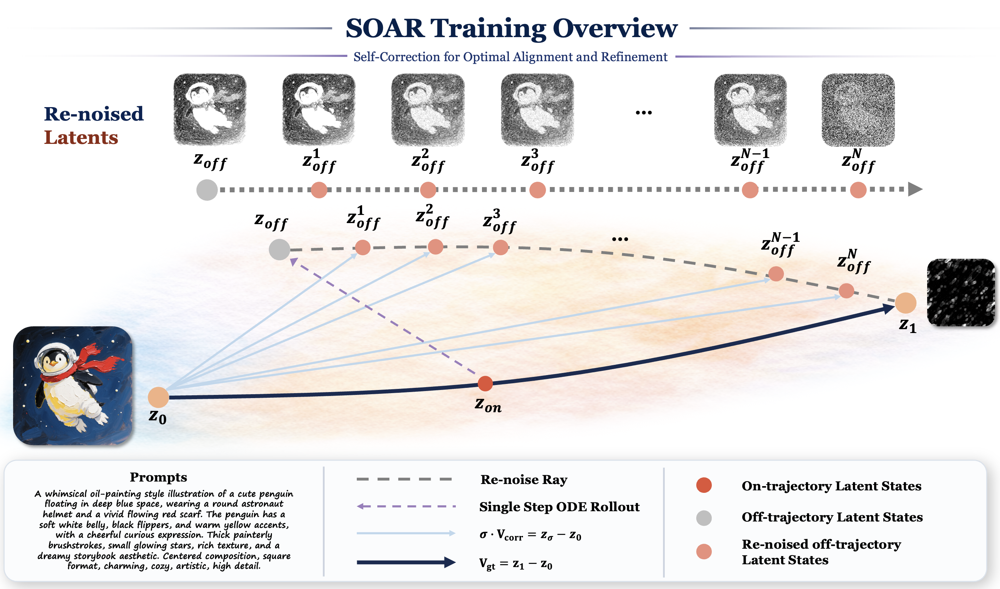
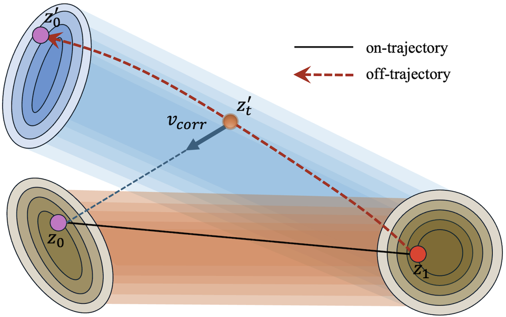
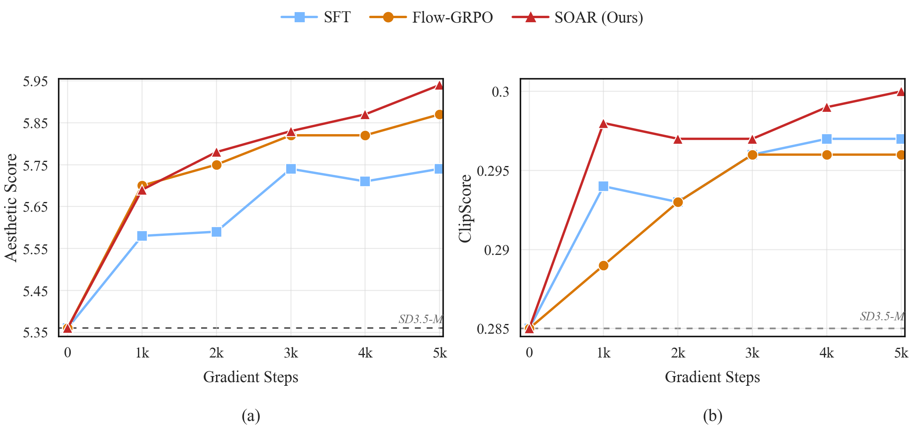

<div align="center">

# HY-SOAR: Self-Correction for Optimal Alignment and Refinement in Diffusion Models

</div>

<div align="center">
  <a href=https://arxiv.org/abs/2604.12617 target="_blank"></a>
  <a href=https://github.com/Tencent-Hunyuan/HY-SOAR target="_blank"></a>
  <a href=https://hy-soar.github.io/ target="_blank"></a>
  <a href=https://x.com/TencentHunyuan target="_blank"></a>
</div>

<p align="center">
  
</p>

## 🔥 News

- **April 2026**: 🎉 HY-SOAR open source - Training and evaluation code publicly available.

## 🗂️ Contents

- [🔥 News](#-news)
- [📖 Introduction](#-introduction)
- [✨ Key Features](#-key-features)
- [🖼 Showcases](#-showcases)
- [📑 Open-Source Plan](#-open-source-plan)
- [🛠 Environment Setup](#-environment-setup)
- [🎯 Reward Preparation](#-reward-preparation)
- [🚀 Usage](#-usage)
- [📊 Evaluation](#-evaluation)
- [🧾 Data Format](#-data-format)
- [📚 Citation](#-citation)
- [🙏 Acknowledgement](#-acknowledgement)

---

## 📖 Introduction

**HY-SOAR** (Self-Correction for Optimal Alignment and Refinement) is a reward-free post-training method for rectified-flow diffusion models. It targets exposure bias in the denoising trajectory: standard SFT trains the denoiser on ideal forward-noising states from real data, while inference conditions on states produced by the model's own earlier predictions. Once an early denoising step drifts, later steps must recover from states that were not directly optimized, so errors can compound across the trajectory.

Instead of waiting for a terminal reward after a full rollout, SOAR teaches the model to correct its own trajectory errors at the timestep where they occur. Given a clean latent $z_0$, noise endpoint $z_1$, and condition $c$, SOAR:
1. Samples an on-trajectory noisy state and performs one stop-gradient CFG rollout step with the current model
2. Re-noises the resulting off-trajectory state toward the same noise endpoint $z_1$ to create auxiliary states
3. Supervises the denoiser with the analytical correction target $v_{\mathrm{corr}} = (z_{\sigma_{t'}} - z_0) / \sigma_{t'}$

This gives SOAR an on-policy, dense, and reward-free training signal. The base objective subsumes standard SFT, while the auxiliary correction loss trains on nearby model-induced states, making SOAR a stronger first post-training stage that remains compatible with subsequent reward-based alignment.
<p align="center">
  
</p>

## ✨ Key Features

* 🧭 **Exposure-Bias Correction:** SOAR directly addresses the mismatch between ground-truth training states and model-induced inference states, the source of many compounding denoising failures.

* 🔁 **On-Policy Off-Trajectory Supervision:** Off-trajectory states are produced by the current model's own rollout, so the training distribution co-evolves with the model instead of staying fixed to the SFT data trajectory.

* 🎯 **Reward-Free Dense Objective:** SOAR requires no reward model, preference labels, or negative samples. It provides per-timestep correction supervision and avoids terminal-reward credit assignment.

* 📐 **Geometric Correction Target:** Re-noising uses the same noise endpoint as the base flow-matching pair, keeping auxiliary states near the original transport ray and yielding a concrete correction velocity anchored to $z_0$.

* 🔧 **Compatible Post-Training Stage:** The SOAR loss extends the standard flow-matching objective, so it can replace SFT as a stronger first post-training stage while remaining compatible with later RL alignment.

## 🖼 Showcases

**Showcase 1: Aesthetic Reward Optimization**

Comparison of SOAR vs Flow-GRPO vs SFT across training steps, optimizing for aesthetic quality on diverse prompts (historical scenes, fantasy art, character portraits).

<div align="center">
  
</div>

**Showcase 2: CLIPScore Reward Optimization**

Comparison on design and poster generation prompts, optimizing for text-image alignment (CLIPScore). SOAR demonstrates stronger text rendering and compositional fidelity.

<div align="center">
  
</div>

**Showcase 3: WebUI / Design Generation**

SOAR results on web UI and graphic design generation, showing accurate layout, typography, and visual hierarchy.

<div align="center">
  
</div>

## 📑 Open-Source Plan

- HY-SOAR
  - [x] Training code
  - [x] Evaluation code

## 🛠 Environment Setup

Our implementation is based on the [DiffusionNFT](https://github.com/NVlabs/DiffusionNFT) and [Flow-GRPO](https://github.com/yifan123/flow_grpo) codebases, with most environments aligned.

Clone this repository and install packages by:

```bash
git clone https://github.com/Tencent-Hunyuan/HY-SOAR.git
cd HY-SOAR

conda create -n hy-soar python=3.10.16
conda activate hy-soar
pip install torch==2.6.0 torchvision==0.21.0 --index-url https://download.pytorch.org/whl/cu126
pip install -e .
export PYTHONPATH=$PWD/sora:$PYTHONPATH
```

**Base Model:** The training script expects [stabilityai/stable-diffusion-3.5-medium](https://huggingface.co/stabilityai/stable-diffusion-3.5-medium) as the pretrained model. You need to accept the model license on Hugging Face and authenticate via `huggingface-cli login` before training.

## 🎯 Reward Preparation

Our supported reward models include [GenEval](https://github.com/djghosh13/geneval), [OCR](https://github.com/PaddlePaddle/PaddleOCR), [PickScore](https://github.com/yuvalkirstain/PickScore), [ClipScore](https://github.com/openai/CLIP), [HPSv2.1](https://github.com/tgxs002/HPSv2), [Aesthetic](https://github.com/christophschuhmann/improved-aesthetic-predictor), and [ImageReward](https://github.com/zai-org/ImageReward). We additionally support `HPSv2.1` on top of FlowGRPO, and simplify `GenEval` from remote server to local.

### 📦 Checkpoints Downloading

```bash
mkdir reward_ckpts
cd reward_ckpts
# Aesthetic
wget https://github.com/christophschuhmann/improved-aesthetic-predictor/raw/refs/heads/main/sac+logos+ava1-l14-linearMSE.pth
# GenEval
wget https://download.openmmlab.com/mmdetection/v2.0/mask2former/mask2former_swin-s-p4-w7-224_lsj_8x2_50e_coco/mask2former_swin-s-p4-w7-224_lsj_8x2_50e_coco_20220504_001756-743b7d99.pth
# ClipScore
wget https://huggingface.co/laion/CLIP-ViT-H-14-laion2B-s32B-b79K/resolve/main/open_clip_pytorch_model.bin
# HPSv2.1
wget https://huggingface.co/xswu/HPSv2/resolve/main/HPS_v2.1_compressed.pt
cd ..
```

### 🧪 Reward Environments

```bash
# GenEval
pip install -U openmim
mim install mmengine
git clone https://github.com/open-mmlab/mmcv.git
cd mmcv; git checkout 1.x
MMCV_WITH_OPS=1 FORCE_CUDA=1 pip install -e . -v
cd ..

git clone https://github.com/open-mmlab/mmdetection.git
cd mmdetection; git checkout 2.x
pip install -e . -v
cd ..

pip install open-clip-torch clip-benchmark

# OCR
pip install paddlepaddle-gpu==2.6.2
pip install paddleocr==2.9.1
pip install python-Levenshtein

# HPSv2.1
pip install hpsv2x==1.2.0

# ImageReward
pip install image-reward
pip install git+https://github.com/openai/CLIP.git
```

## 🚀 Usage

### 🔥 Training

The default SOAR v4 training setup uses a single-node 8-GPU run on high-aesthetic data (`score >= 6.8`). The per-GPU batch size is 4, so the global batch size is 32. The default rollout configuration is ODE-only (`--num_rollout_paths 1`) with 6 auxiliary points and 40 sampling steps.

```bash
export ACCELERATE_USE_DEEPSPEED=true
export ACCELERATE_DEEPSPEED_CONFIG_FILE=/path/to/ds_zero2_config.json
export ACCELERATE_DEEPSPEED_ZERO_STAGE=2

torchrun \
    --nnodes=1 \
    --node_rank=0 \
    --nproc_per_node=8 \
    --master_addr=localhost \
    --master_port=29522 \
    -m sora.train_soar_sd3_5m \
    --pretrained_model_name_or_path /path/to/stable-diffusion-3.5-medium \
    --jsonl_path /path/to/high_aesthetic.jsonl \
    --image_dir /path/to/images \
    --output_dir ./output/sd3.5m_soar_high_aesthetic \
    --resolution 512 \
    --train_batch_size 4 \
    --gradient_accumulation_steps 1 \
    --max_train_steps 5000 \
    --checkpointing_steps 1000 \
    --seed 42 \
    --learning_rate 2e-5 \
    --lr_scheduler constant \
    --lr_warmup_steps 0 \
    --adam_weight_decay 1e-2 \
    --max_grad_norm 1.0 \
    --weighting_scheme logit_normal \
    --mixed_precision bf16 \
    --dataloader_num_workers 16 \
    --gradient_checkpointing \
    --allow_tf32 \
    --report_to tensorboard \
    --num_rollout_paths 1 \
    --trajectory_length 6 \
    --num_sampling_steps 40 \
    --sde_rollout_type flow_sde \
    --sde_noise_scale 0.5 \
    --lambda_aux 1.0 \
    --cfg_scale_sampling 4.5
```

Default training parameters:

| Parameter | Default | Description |
| --- | --- | --- |
| GPUs | 8 | Single-node training |
| Global batch size | 32 | `--train_batch_size 4` x 8 GPUs x `--gradient_accumulation_steps 1` |
| `--max_train_steps` | 5000 | Total optimization steps |
| `--checkpointing_steps` | 1000 | Checkpoint interval |
| `--seed` | 42 | Training seed |
| `--learning_rate` | 2e-5 | AdamW learning rate |
| `--lr_scheduler` | constant | Learning-rate schedule |
| `--lr_warmup_steps` | 0 | Warmup steps |
| `--adam_weight_decay` | 1e-2 | AdamW weight decay |
| `--max_grad_norm` | 1.0 | Gradient clipping norm |
| `--weighting_scheme` | logit_normal | Timestep weighting scheme |
| `--mixed_precision` | bf16 | Mixed precision mode |
| `--dataloader_num_workers` | 16 | Data loader workers |
| `--lambda_aux` | 1.0 | Weight for auxiliary SOAR loss |
| `--num_rollout_paths` | 1 | Number of rollout paths (1=ODE only) |
| `--trajectory_length` | 6 | Auxiliary points per path |
| `--sde_rollout_type` | flow_sde | Stochastic rollout mode: `cps`, `simple`, `sde`, `flow_sde` |
| `--sde_noise_scale` | 0.5 | Noise scale for stochastic rollout |
| `--cfg_scale_sampling` | 4.5 | CFG scale for rollout velocity |
| `--num_sampling_steps` | 40 | Total sampling steps (determines step size) |

### 📊 Running Evaluation

Generate images and save results with distributed inference:

```bash
torchrun --nproc_per_node=8 -m sora.evaluation \
    --checkpoint_path ./output/soar_sd3_5m/checkpoint-5000 \
    --model_type sd3 \
    --dataset geneval \
    --guidance_scale 4.5 \
    --resolution 512 \
    --mixed_precision bf16 \
    --save_images \
    --output_dir ./eval_output
```

The `--dataset` flag supports `geneval`, `ocr`, `pickscore`, and `drawbench`.

## 📊 Evaluation

### 📋 Main Results on DrawBench

Following [Flow-GRPO](https://arxiv.org/abs/2505.05470), we evaluate image quality and human preference scores on **DrawBench** prompts. Task-specific metrics (GenEval, OCR) are evaluated on their respective test sets. All models are trained at 512×512 with cfg=4.5.

| Model | #Iter | GenEval | OCR | PickScore | ClipScore | HPSv2.1 | Aesthetic | ImgRwd |
| --- | --- | --- | --- | --- | --- | --- | --- | --- |
| SD-XL (1024²) | – | 0.55 | 0.14 | 22.42 | 0.287 | 0.280 | 5.60 | 0.76 |
| SD3.5-L (1024²) | – | 0.71 | 0.68 | 22.91 | 0.289 | 0.288 | 5.50 | 0.96 |
| FLUX.1-Dev | – | 0.66 | 0.59 | 22.84 | 0.295 | 0.274 | 5.71 | 0.96 |
| SD3.5-M | – | 0.63 | 0.59 | 22.34 | 0.285 | 0.279 | 5.36 | 0.85 |
| + SFT | 10k | 0.70 | 0.64 | 22.71 | 0.295 | 0.284 | 5.35 | 1.04 |
| **+ SOAR (Ours)** | **10k** | **0.78** | **0.67** | **22.86** | **0.295** | **0.289** | **5.46** | **1.09** |

On DrawBench and the corresponding GenEval/OCR test sets from [Flow-GRPO](https://arxiv.org/abs/2505.05470), SOAR raises SD3.5-Medium's GenEval score from 0.70 to 0.78 (+11% relative) and OCR accuracy from 0.64 to 0.67, all without any reward model during training.

### 📈 Reward-Specific Training Dynamics

In head-to-head comparisons on DrawBench Aesthetic Score and ClipScore, SOAR's final scores not only surpass SFT but also outperform Flow-GRPO, which explicitly uses these metrics as its reward signal (Aesthetic: 5.94 vs. SFT 5.74 / Flow-GRPO 5.87; ClipScore: 0.300 vs. SFT 0.297 / Flow-GRPO 0.296).

<p align="center">
  <a href="./assets/reward_curves_seaborn_preview.pdf">
    
  </a>
</p>

## 🧾 Data Format

The training script expects a JSONL file where each line contains:

```json
{"md5": "image_hash", "caption_en": "A photo of ...", "bw": 512, "bh": 512}
```

- `md5`: Image filename (without extension). Images are stored as `{md5}.jpg` in `--image_dir`.
- `caption_en`: English text prompt.
- `bw`, `bh`: Bucket width and height (the resolution to resize/crop the image to).

## 📚 Citation

If you find HY-SOAR useful in your research, please cite our work:

```bibtex
@article{hy-soar,
  title={SOAR: Self-Correction for Optimal Alignment and Refinement in Diffusion Models},
  author={Qin, You and Wang, Linqing and Fei, Hao and Zimmermann, Roger and Bo, Liefeng and Lu, Qinglin and Wang, Chunyu},
  journal={arXiv preprint arXiv:2604.12617},
  year={2026},
  eprint={2604.12617},
  archivePrefix={arXiv},
  primaryClass={cs.LG}
}
```

## 🙏 Acknowledgement

We thank the [DiffusionNFT](https://github.com/NVlabs/DiffusionNFT) repository, the [Flow-GRPO](https://github.com/yifan123/flow_grpo) project, and Hugging Face [diffusers](https://github.com/huggingface/diffusers) for their open-source codebases.
